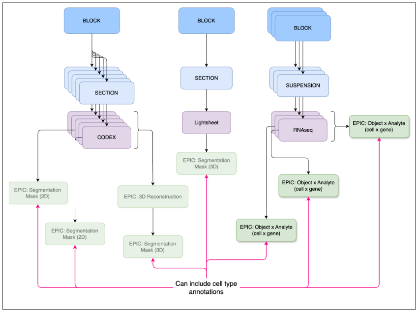

## EPIC Example Type 2
### Object by Analyte: <mark>Draft</mark>

<mark>This specification is undergoing final testing, using example datasets.</mark>
Object x analyte are data matrices containing the measured analyte levels for a set of analytes across a set of objects such as cells or nuclei (see Fig 3). For example, this could be a matrix of barcoded cells x gene expression values or a matrix of barcoded cells x metabolite levels. The values included might be raw computed gene expression values or normalized values, spanning multiple datasets. Alternatively, an object x analyte dataset could simply denote a novel set of annotations for an existing analysis. In this case, it would _not_ include the main data matrix.

- [Documentation](https://docs.google.com/document/d/1TkmleE99wpynqSa0MS47Z8Q2vG1ru47fNFl-5KFJKoo/edit?tab=t.0#heading=h.1u82i4axggee)
- [Draft metadata schema](https://docs.google.com/spreadsheets/d/1sMMyKtrxD_PO4TVj0JhOpeLF0fRYe2Fjmxnhp-fNzdM/edit?gid=0#gid=0)
- [Draft file hierarchy schema](https://docs.google.com/spreadsheets/d/1D7bqjQvItGj6oOlf3BRIxF_M_64CucSeanICFPolK-c/edit?gid=37240204#gid=37240204)

**Figure 3:** Object x analyte EPICs capture non-image based analyses.
