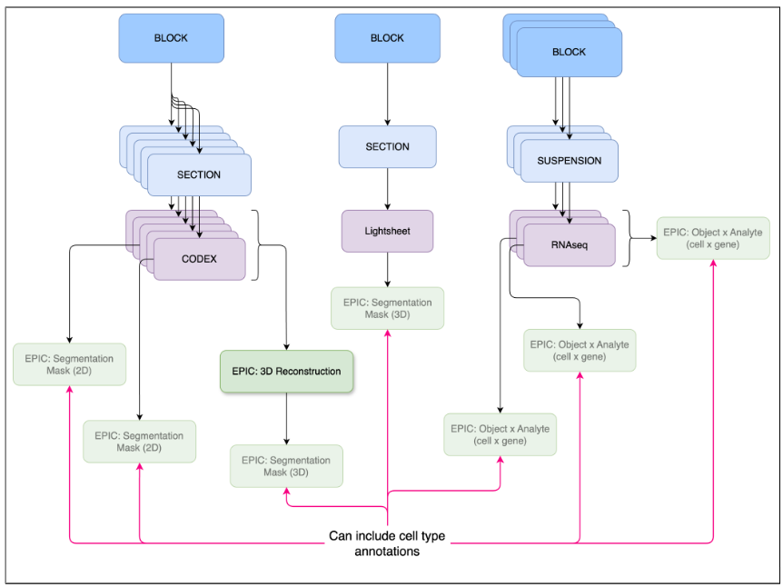

## EPIC Example Type 3
### 3D Reconstruction: <mark>Draft</mark>

<mark>This specification is in need of example datasets that can be used for testing.</mark>
3D reconstructions are pseudo 3D volumes generated from serial sections (see Fig 4). All images used to create the 3D reconstruction must be uploaded prior to uploading this EPIC. True 3D images such as from the lightsheet assay should be uploaded as primary data and not using this EPIC datatype. A 3D reconstruction might not be a comprehensive 3D volume, for example, if one of the serial sections is missing. Hence, these are considered “pseudo” 3D volumes and sometimes referred to as “2.5D”. There is also no expectation with regard to the type of images used in a 3D reconstruction. For example, the reconstruction could include Visium, histology, and CODEX images. 

- [Documentation](https://docs.google.com/document/d/1MBJ4WkAeAXvIndaXrwPGd2MEnRtkpXenWNGzklYEky0/edit?tab=t.0)
- [Draft metadata schema](https://docs.google.com/spreadsheets/d/1UxyTQvcDDL173Lsus7nUodsgasQsBtIQZjLDnI9nBpk/edit?gid=0#gid=0)
- [Draft file hierarchy schema](https://docs.google.com/spreadsheets/d/1ONb1mEQ6hda4w2kDr6sVeqK80ipB0pbTgCP7K88lUuc/edit?gid=37240204#gid=37240204)

**Figure 4:** A 3D reconstruction is typically a 3D image creatred from combining a set of 2D images.
