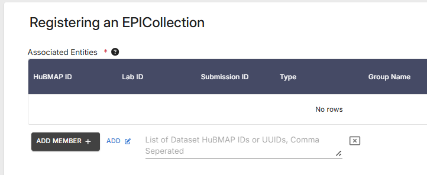

## Cell Type Annotations
A critical component of EPICs is capturing lab-derived cell type annotations, specifically annotations curated by data providers with expert knowledge about the datasets. While not yet feasible, cell type annotations from EPICs will soon allow Data Portal users to query datasets with questions like "which datasets have B cells?"

For Segmentation Mask EPICs, part of the ingestion process includes collection of the distinct object types in the masks, annotation tools used, whether the mask is 2D or 3D, and more. This information is integrated into the database that underlies the Data Portal searches. The Data Portal is currently being updated to make use of this new information, allowing users to use these details to filter datasets (e.g., "which contain FTUs annotated by FUSION?"). With the finalization of the Object x Analyte EPIC, the Data Portal will be expanded to allow for queries like "which RNA-seq datasets contain cell type annotations from Azimuth?"

## Uploading EPICs
Data providers can submit EPICs via the [HuBMAP Ingest UI](https://ingest.hubmapconsortium.org/)
- To start the process, navigate to the Ingest UI in your browser
- Click on the **Individual** registration drop-down menu and select **Collection - EPIC** (Fig 5A).
  
   

&nbsp;&nbsp;&nbsp;&nbsp;&nbsp;&nbsp;&nbsp;&nbsp;**Figure 5A:** Ingest UI registration options.
  
  - This method is very similar to submitting non-EPIC data
    
- The _Register an EPIC Collection_ dialog displays (Fig 5B)
  
  
  
  &nbsp;&nbsp;&nbsp;&nbsp;&nbsp;&nbsp;**Figure 5B:** Register an EPIC Collection dialog.
  
- Enter a _title_ and a _description_ for the EPIC data upload
- Click the **Bulk** link (next to the **Add Member +** button) to display a field where you can enter multiple HuBMAP IDs or UUIDs for datasets in a comma-separated list (Fig 5C):
  
   

   &nbsp;&nbsp;&nbsp;&nbsp;&nbsp;&nbsp;**Figure 5C:** Close-up detail of Multiple Dataset IDs field.
  
  - These datasets will be associated with the EPIC
- Click the **Submit** button (shown in Fig. 5B, above)
  - A HuBMAP ID and Globus directory will be created for the upload.
- For more information on registering data via the Ingest UI, see [Data Submission Guide - registering data](https://docs.hubmapconsortium.org/data-submission/Section3).
