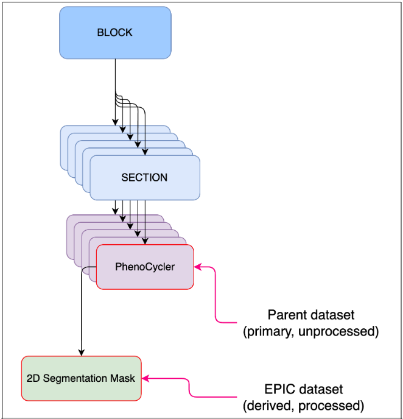
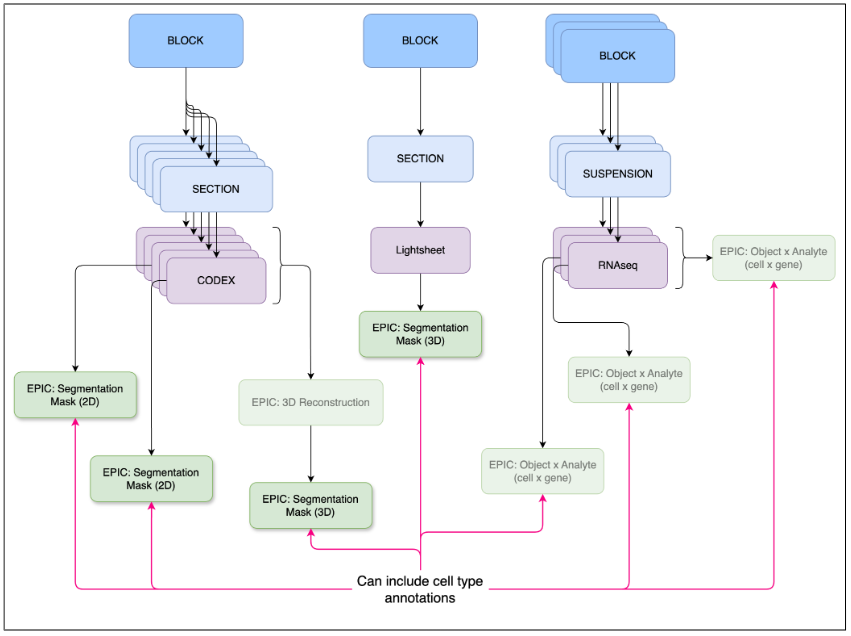
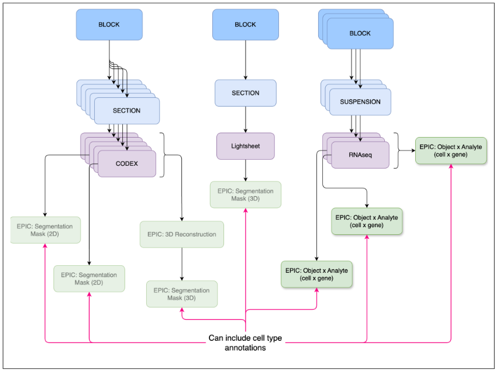
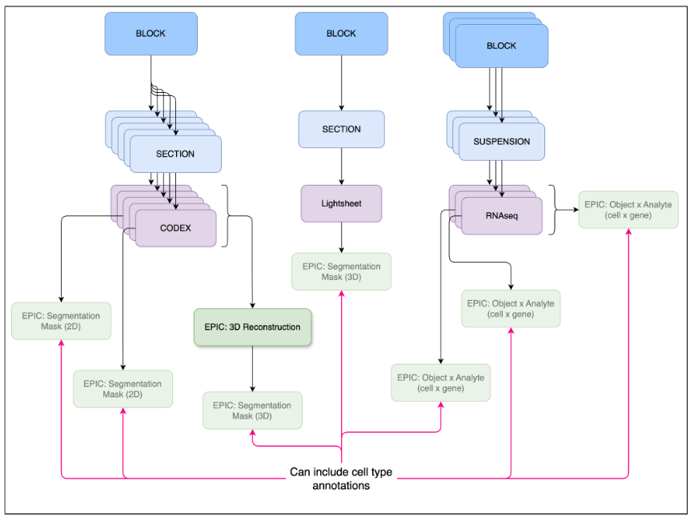
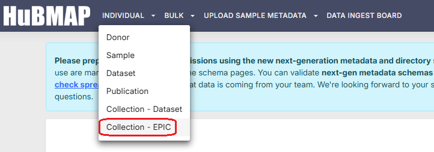
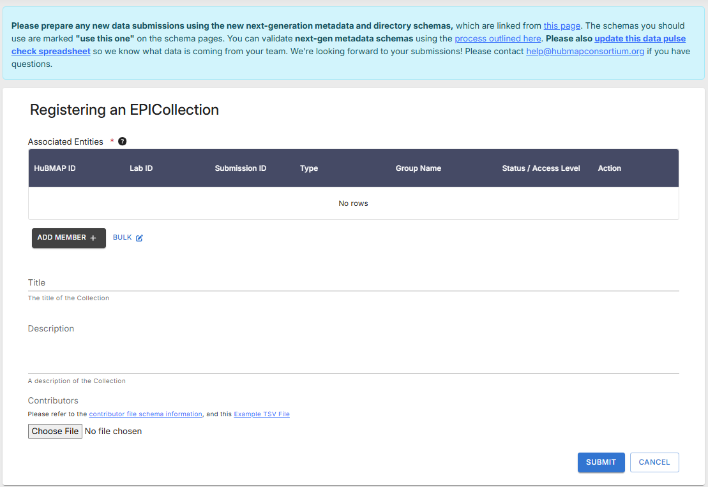
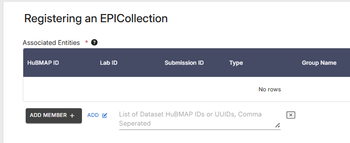
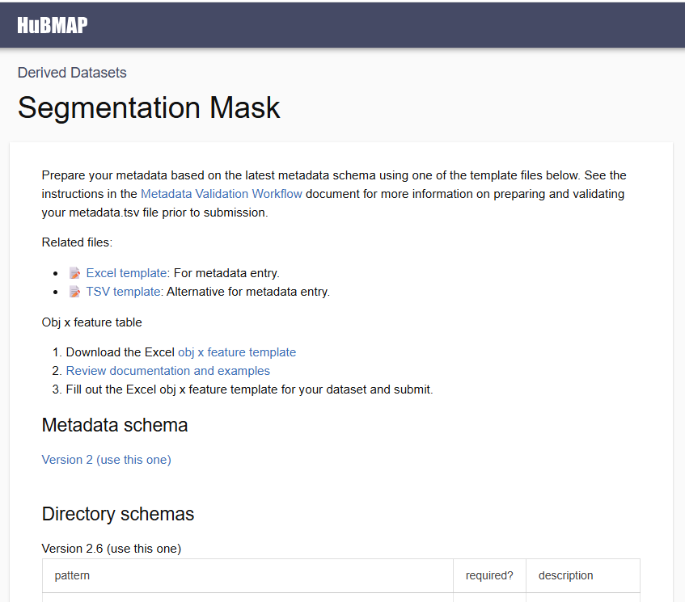

# HuBMAP EPICs Overview
Externally Processed Integrated Collection(s)

## What is an EPIC?
An EPIC (Externally Processed Integrated Collection) is a processed or analyzed dataset generated by a lab. The EPIC dataset could be derived by analyzing one or more primary or derived datasets. The dataset(s) processed to create the EPIC is considered the “parent” dataset (see Fig 1).

Examples:
- A lab generates a segmentation mask that identifies cells from a CODEx run. The segmentation mask is an EPIC (i.e., derived dataset), while the PhenoCycler imaging data is the primary dataset that is the parent dataset for the EPIC (see Fig 1). 
- A lab generates novel cell type annotations using a previously published (EPIC) segmentation mask. This novel set of annotations is new EPIC with the parent being the original segmentation mask EPIC. 
- A lab processes ten RNAseq datasets, generating a normalized cell by gene matrix and Azimuth cell annotations. This derived dataset. consisting of the normalized cell by gene matrix and cell type annotations, is a single EPIC even if the lab used a HuBMAP pipeline to process the ten RNAseq datasets. The ten RNAseq datasets are the parent datasets for this EPIC; that is, the EPIC dataset has ten parent datasets.
- A lab downloads a published, processed dataset that includes a cell by gene matrix. The lab generates a new set of cell type annotations. This new annotation set is an EPIC with the pre-existing processed dataset being the parent.
- A lab combines a set of 30 histology images into a (pseudo) 3D image, using a HuBMAP 3D reconstruction pipeline or any other 3D reconstruction pipeline. The 3D reconstruction is an EPIC with 30 parent datasets (i.e., the 30 histology datasets). If the lab generates 3D segmentation masks using the 3D reconstruction, then the 3D segmentation masks are a new EPIC with the parent being the single 3D reconstruction EPIC.

&nbsp;&nbsp;&nbsp;&nbsp;&nbsp;&nbsp; 

**Figure 1:** EPIC dataset example (2D segmentation mask) and the upstream, parent dataset (PhenoCycler).

Please contact the [HuBMAP Helpdesk](help@hubmapconsortium.org), if you require assistance or have questions about EPICs.

## Types of EPICs
We’ve defined three types of EPICs: (1) segmentation masks, (2) object by analyte, and (3) 3D reconstruction. The three EPICs should support a broad range of analysis:
- Single assays results: multiomic (dissociated), spatial, volumetric
- Annotations: cell types and other structures in dissociated or spatial assays
- Annotations: 2D and 3D segmentations, naming of features, stacking 2D slices to construct a volume
- Annotations: Stacking multi-modal assays done on slices
- Annotations: Imputing expression in cells in ‘gaps between’ slices
  
There are currently no plans to define new types of EPICs. If you have derived data you would like to upload that doesn’t map to one of these dataset types, please contact the [HuBMAP Helpdesk](help@hubmapconsortium.org).

## EPIC Example Type 1
### Segmentation Mask: <mark>Published</mark>

<mark>This is a published specification, which has been tested, is stable, and can be used to submit relevant EPIC datasets.</mark>
Segmentation of images is performed manually or by an algorithm that predicts edges of structures. Structures may be nuclear membrane, cell membranes, or larger structures such as tubules. Segmentation mask EPICs work with 2D and 3D images (see Fig 2). 

A 3D EPIC will include:
- 3D OME-TIFF
- Z coordinates for the object centroids
- 3D mesh file (optional).

If a 3D segmentation mask is based on a 3D image that’s been constructed from 2D serial sections, the “parent dataset” must be a 3D Reconstruction EPIC (see 3D Reconstruction below).

- [Published specification](https://hubmapconsortium.github.io/ingest-validation-tools/segmentation-mask/current/)
- [Documentation](https://docs.google.com/document/d/1LgQ509UOoZsY-sZO1cBFtqxWbo3jLGyCVy-_mssBVMw/edit?tab=t.0#heading=h.1u82i4axggee)

**Figure 2:** Segmentation mask EPICs can be derived from 2D or 3D images.

## EPIC Example Type 2
### Object by Analyte: <mark>Published</mark>

<mark>This is a published specification, which has been tested, is stable, and can be used to submit relevant EPIC datasets.</mark>
Object x analyte are data matrices containing the measured analyte levels for a set of analytes across a set of objects such as cells or nuclei (see Fig 3). For example, this could be a matrix of barcoded cells x gene expression values or a matrix of barcoded cells x metabolite levels. The values included might be raw computed gene expression values or normalized values, spanning multiple datasets. Alternatively, an object x analyte dataset could simply denote a novel set of annotations for an existing analysis. In this case, it would _not_ include the main data matrix.

- [Published specification](https://hubmapconsortium.github.io/ingest-validation-tools/object-x-analyte/current/)
- [Documentation](https://docs.google.com/document/d/1TkmleE99wpynqSa0MS47Z8Q2vG1ru47fNFl-5KFJKoo/edit?tab=t.0#heading=h.1u82i4axggee)
- [MuData Validation Jupyter Notebook](https://github.com/hubmapconsortium/mudata-validator/blob/main/validate_example.ipynb)
  - Data providers can use this example Jupyter Notebook to validate their MuData objects.
  - The completed notebook can be used to validate EPICs of this type.

**Figure 3:** Object x analyte EPICs capture non-image based analyses.

## EPIC Example Type 3
### 3D Reconstruction: <mark>Draft</mark>

<mark>This specification is in need of example datasets that can be used for testing.</mark>
3D reconstructions are pseudo 3D volumes generated from serial sections (see Fig 4). All images used to create the 3D reconstruction must be uploaded prior to uploading this EPIC. True 3D images such as from the lightsheet assay should be uploaded as primary data and not using this EPIC datatype. A 3D reconstruction might not be a comprehensive 3D volume, for example, if one of the serial sections is missing. Hence, these are considered “pseudo” 3D volumes and sometimes referred to as “2.5D”. There is also no expectation with regard to the type of images used in a 3D reconstruction. For example, the reconstruction could include Visium, histology, and CODEX images. 

- [Documentation](https://docs.google.com/document/d/1MBJ4WkAeAXvIndaXrwPGd2MEnRtkpXenWNGzklYEky0/edit?tab=t.0)
- [Draft metadata schema](https://docs.google.com/spreadsheets/d/1UxyTQvcDDL173Lsus7nUodsgasQsBtIQZjLDnI9nBpk/edit?gid=0#gid=0)
- [Draft file hierarchy schema](https://docs.google.com/spreadsheets/d/1ONb1mEQ6hda4w2kDr6sVeqK80ipB0pbTgCP7K88lUuc/edit?gid=37240204#gid=37240204)

**Figure 4:** A 3D reconstruction is typically a 3D image creatred from combining a set of 2D images.

## Cell Type Annotations
A critical component of EPICs is capturing lab-derived cell type annotations, specifically annotations curated by data providers with expert knowledge about the datasets. While not yet feasible, cell type annotations from EPICs will soon allow Data Portal users to query datasets with questions like "which datasets have B cells?"

For Segmentation Mask EPICs, part of the ingestion process includes collection of the distinct object types in the masks, annotation tools used, whether the mask is 2D or 3D, and more. This information is integrated into the database that underlies the Data Portal searches. The Data Portal is currently being updated to make use of this new information, allowing users to use these details to filter datasets (e.g., "which contain FTUs annotated by FUSION?"). With the finalization of the Object x Analyte EPIC, the Data Portal will be expanded to allow for queries like "which RNA-seq datasets contain cell type annotations from Azimuth?"

## Uploading EPICs
Data providers can submit EPICs via the [HuBMAP Ingest UI](https://ingest.hubmapconsortium.org/)
<ul>
    <li>To start the process, navigate to the Ingest UI in your browser</li>
    <li>Click on the <strong>Individual</strong> registration drop-down menu and select <strong>Collection - EPIC</strong> (Fig 5A).</li>
    
  
 <strong>Figure 5A:</strong> Ingest UI registration options. 

   <ul>
       <li>This method is very similar to submitting non-EPIC data</li>
   </ul>
   <li>The <i>Register an EPIC Collection</i> dialog displays (Fig 5B)</li>
  
  
 <strong>Figure 5B:</strong> Register an EPIC Collection dialog. 

  
  <li>Enter a <i>title</i> and a <i>description</i> for the EPIC data upload</li>
  <li>Click the <strong>Bulk</strong> link (next to the <strong>Add Member +</strong> button) to display a field where you can enter multiple HuBMAP IDs or UUIDs for datasets in a comma-separated list (Fig 5C):</li>

 
 <b>Figure 5C:</b> Close-up detail of Multiple Dataset IDs field. 

   
  <ul>
      <li>These datasets will be associated with the EPIC</li>
  </ul> 
  <li>Click the <strong>Submit</strong> button (shown in Fig. 5B, above)</li>
  <ul>
     <li>A HuBMAP ID and Globus directory will be created for the upload.</li>
  </ul>
  </ul>
  
  For more information on registering data via the Ingest UI, see [Data Submission Guide - registering data](https://docs.hubmapconsortium.org/data-submission/Section3).
  

## Minimum Upload Requirements
Like non-EPIC data uploads, EPICs have file requirements for successful data submission (Fig 6):
- An _assay metadata_ file titled "metadata.tsv" 
  - A list of currently-supported epics can be found [here](https://docs.hubmapconsortium.org/metadata).
- A _contributors metadata_ file titled "contributors.tsv" 
  - The contributors metadata template can be found [here](https://hubmapconsortium.github.io/ingest-validation-tools/contributors/current/).
- **Note:** The "metadata.tsv" and "contributors.tsv" files should be validated using the [Metadata Spreadsheet Validator](https://metadatavalidator.metadatacenter.org/).
- Data files required by the EPIC's directory schema.
  - A list of currently-supported epics can be found [here](https://docs.hubmapconsortium.org/metadata).
  - Each EPIC dataset should have a corresponding _subdirectory_ containing all the files in the directory schema.
  - Each row of the metadata file should reference one of these subdirectories via the data_path field.

**Figure 6:** Reqired Metadata, Contributor, and Data files (and directories) for EPIC datasets.
