# Publication Page Submission
## Introduction
_What is the purpose of publication pages?_  
The purpose of [publication pages](https://portal.hubmapconsortium.org/publications) in the HuBMAP Data Portal is to:
- provide an overview of and showcase HuBMAP publications
- make it easy for members of the community to find datasets, samples, and donors included in HuBMAP publications
- feature exciting data through interactive [Vitessce-based visualizations](https://vitessce.io) in ways not possible in PDF-based publications

<mark>Note:</mark> Authors are encouraged to reference dataset collections or individual dataset DOIs in their publications.  
Publication pages do not have assigned DOIs, as they are able to be updated.
  
_Who can contribute to a publication page?_  
- Any HuBMAP member can submit a publication page for any publication that uses publicly available data in the HuBMAP Data Portal.
- Both preprints and published papers can be shared as publication pages.
- <mark>Note:</mark> The HuBMAP HIVE will _not_ be responsible for the creation of publication pages or maintenance of their content beyond regular HuBMAP Data Portal maintenance. 

_What is the process of submitting a publication page?_  
To re-use existing HuBMAP infrastructure and processes, publication pages use a process that is very similar to regular dataset submissions, see details below. 
- Like datasets, a publication page (or “publication dataset”) can be updated at any time by the authors.
- Initially, publication pages will be in “QA” status and only accessible to consortium members.
- Once they have been reviewed by the authors, the HuBMAP HIVE curation team will switch the status to “Published.”

## Prerequisites
1. The Globus organization associated with your Globus user account must be a “Data Provider” group. If you previously submitted data to the HuBMAP Data Portal, that will be the case. If not, please contact the [HuBMAP Helpdesk](mailto:help@hubmapconsortium.org). 
2. Prepare a Submissions Directory. Similar to submitting datasets to the HIVE (HuBMAP), set up a directory based on the 
[metadata and directory schemas](https://hubmapconsortium.github.io/ingest-validation-tools/publication/) for a "publication."

### Contacts
- For all general questions, including communication regarding QA, please contact the [HuBMAP Help Desk](mailto:help@hubmapconsortium.org)
- For questions on Vitessce vignette preparation: [Mark Keller](mailto:mark_keller@hms.harvard.edu)
- For questions on Data Ingestion (ingestion portal, Globus, data provider groups): [Brendan Honick](mailto:help@hubmapconsortium.org,bhonick@andrew.cmu.edu)

## 1. Create Publication
&nbsp;&nbsp; a. Start at the [Ingest Portal](https://ingest.hubmapconsortium.org).  
&nbsp;&nbsp; b. Select “Publication” in the “Register New: Individual” menu. You can also follow this [link](https://ingest.hubmapconsortium.org/new/publication) to get to that page. 
 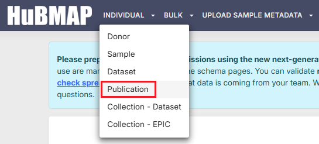  
&nbsp;&nbsp; The "Registering a Publication" dialog will display:

<i>Click here to display &#x25BC; (or hide &#x25B6;) the image below...</i>

 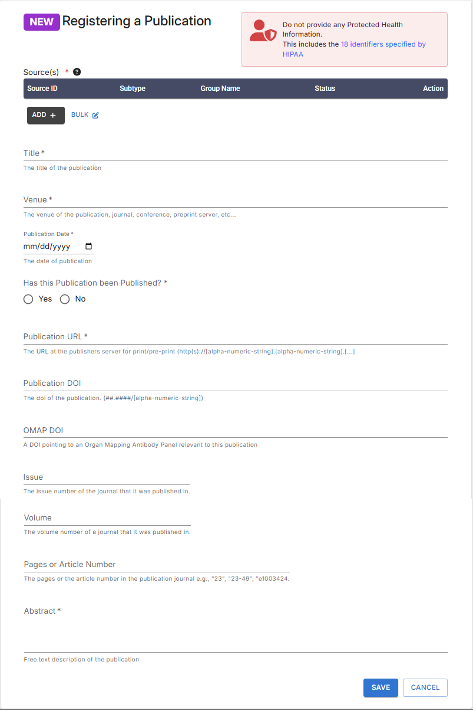  

&nbsp;&nbsp; c. Fill out all required fields and enter as much information as possible into the optional fields.  
&nbsp;&nbsp; <mark>Note:</mark> In particular, make sure to select _all_ HuBMAP datasets in the portal that were used in your publication.  
&nbsp;&nbsp;&nbsp;&nbsp; This information will be used to automatically infer donors and samples that are part of your publication  
&nbsp;&nbsp;&nbsp;&nbsp; and display them on the publication page in addition to the datasets.    
&nbsp;&nbsp; d. To add datasets to the Publication, click the "Add+" button under "Sources."
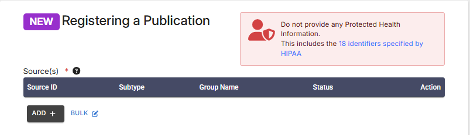  
&nbsp;&nbsp; e. Search for the datasets you want to add, click on a dataset to select it.

- Important: For wild card searches, add "*" at the beginning and / or end of your keyword string
- You can also select a group (institution)
  
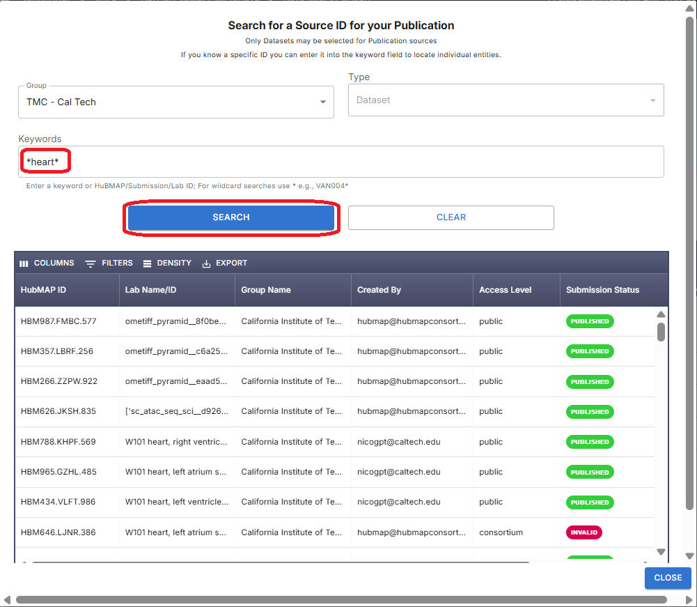  
&nbsp;&nbsp; f. The selected dataset is listed under sources.  
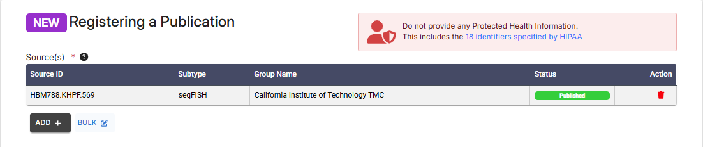  
&nbsp;&nbsp; g. Alternatively, selecting the BULK option allows you to add multiple datasets, separated by commas  
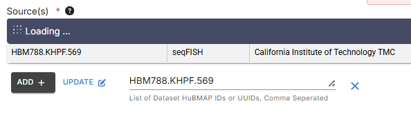  

  

<i>Click here to display &#x25BC; (or hide &#x25B6;) the image below...</i>

   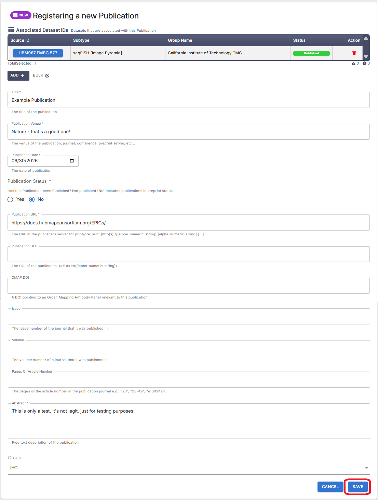 
  

 &nbsp;&nbsp; h. Once complete, click “Save” - The "Success" dialog should display:  
 
  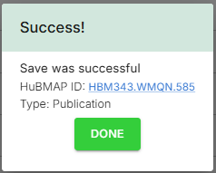 

 - <mark>Note the HuBMAP ID - </mark> This will allow you to locate your Publication when the Success dialog is not present. 
 - The steps above create...
   - A HuBMAP record of your Publication
   - A Globus directory where everything associated with the Publication will be stored
 - Click the link for the Publication's HuBMAP ID to go directly to your Publication.
 - If no changes are needed, you can click DONE on the "Success" dialog - which will close it.

## 2. Locating Your Publication
 - In the main Ingest Portal search, enter the Publication's HuBMAP ID and click SEARCH
 - This will open the "Publication Information" dialog, where you can update the descripton or other information.
   
 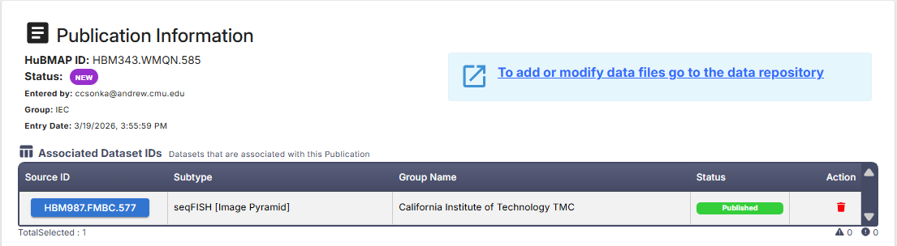  

 - From this dialog, to add or modify data files, link to the data repository, highlighted in light blue (above).

## 3. Preparing Files for Upload
Prepare the data for your publication.  
This should include any supplementary data files and other information that you want to share with the community. 

To prepare your data for upload, organize it according to the “publication” directory schema. 
Use the [ingest validation tools](https://github.com/hubmapconsortium/ingest-validation-tools#for-data-submitters-and-curators) to confirm that your _directory structure_ and _metadata files_ conform to the requirements of the publication assay type once you have assembled your dataset. 

### Directory structure:
- [**metadata.tsv**](https://gist.github.com/keller-mark/45535076f55bf06f8b22006b7dfe61bb#file-metadata-tsv) - Use the schema for the [“publication” assay](https://hubmapconsortium.github.io/ingest-validation-tools/publication/) type. 
- **extras/**
  - [**contributors.tsv**](https://hubmapconsortium.github.io/ingest-validation-tools/contributors/current/)
    - <mark>Note:</mark> The _contributors.tsv_ file will ONLY accept characters in the ASCII character set - see a [reference list](https://www.w3schools.com/charsets/ref_html_ascii.asp).
      - Modify the spelling of any names included in the _contributors.tsv_ to avoid special characters, such as _ö_. 
    - ORCIDs are required for ALL authors. If an ORCID is not available for an author, omit that author from the contributors.tsv
- **vignettes/** - Follow instructions in the [tutorial](https://github.com/vitessce/vitessce-python-tutorial) to construct your visualizations using Python and Jupyter notebooks.
- <mark><b>Note:</b></mark> Vignettes are not required!
  - **vignette_01/** 
    - [**description.md**](https://gist.githubusercontent.com/keller-mark/45535076f55bf06f8b22006b7dfe61bb/raw/d0cf00b54d8c1d3332238629dbc1b4450ac1fe30/description.md) 
  - **vignette_02/**
    - **description.md**
    - **vitessce.json**
  - **vignette_03/**
    - **description.md** - Multiple Vitessce configurations can be added!
    - **vitessce.json**
- **data/** - All supplementary data for your paper and everything else that you want to share goes here.
  - Ensure that everything referenced by your Vitessce visualizations is in the data directory.

#### Minimum Requirements:
- A directory including **metadata.tsv, vignettes/, data/,** and **extras/** at the top level (no enclosing directory).
- These directories are _required_ but can be empty.

See an example of a [directory structure](https://app.globus.org/file-manager?origin_id=af603d86-eab9-4eec-bb1d-9d26556741bb&origin_path=%2Ffa99f1ac5d1b1eb63d8e797149cc8902%2F&two_pane=false), which is from [this publication](https://portal.hubmapconsortium.org/browse/publication/fa99f1ac5d1b1eb63d8e797149cc8902).

### 3.1 Vignettes
Vignettes are optional features specified using Markdown files named "description.md."  
Vignettes can be used to link to external websites or resources and embed interactive visualizations using Vitessce.  
You can share additional documentation, links to external resources, or one or more visualizations of key datasets as “vignettes”.
“Vignettes” will be automatically embedded in the page for your publication. 

#### 3.1.a Links to External Resources
Links to additional collections or other resources can be included in the "description.md" file, using standard markdown link formatting: 
- "[link name here] (https://link-address-here.example.com)" -- _Be sure to OMIT the space between "] (" !_
- Please follow the above directory structure for "vignette_01/," and include a "description.md" file.
- The vitessce.json file is not required, Vitessce visualizations are not required to display this markdown information.

#### 3.1.b Embedding iframes
You may also add externally-hosted iframes to the "description.md" to use an embeddable visualization that does not use Vitessce. 
- These iframes can be provided in the "description.md" file.
- The vitessce.json file is not required, Vitessce visualizations are not required to display this markdown information.
- Servers hosting the visualization must be configured to allow external embedding of the iframe via  
[Content Security Policy headers](https://developer.mozilla.org/en-US/docs/Web/HTTP/Headers/Content-Security-Policy/frame-ancestors).

#### 3.1.c  Vitessce Visualizations
Visualizations of key datasets will automatically be embedded in the publication page if Vignettes are included in the Globus file upload.
- Visualization configurations can be generated directly from an existing visualization on the Portal. To do this:
  - Navigate to the desired dataset visualization
  - Configure preferred settings (e.g., filters, colormaps, zoom level, etc.) for that visualization
  - Click the Share button (top right of Vitessce window) and select one of the options for copying or downloading Configuration files. See example below:  
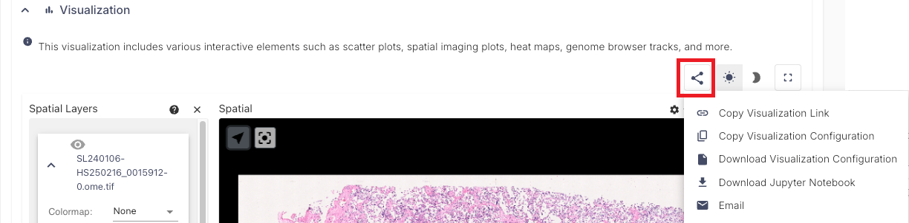  
- To construct alternative or additional visualizations, follow the instructions in the [Vitessce tutorial](https://github.com/vitessce/vitessce-python-tutorial) using Python and Jupyter notebooks.
- An example can be viewed for [this publication](https://portal.hubmapconsortium.org/browse/publication/2ced91fd6d543e79af90313e52ada57d). 
- The Globus directory for the above publication can be viewed [here](https://app.globus.org/file-manager?origin_id=af603d86-eab9-4eec-bb1d-9d26556741bb&origin_path=%2F2ced91fd6d543e79af90313e52ada57d%2F) (requires Globus login).

### 3.2 Globus File Upload
This section provides options for uploading files associates with publications via Globus. 

<mark>Note for Mac Users:</mark> Ensure there are no ".DS_Store"files in the directories prior to upload to Globus.  
- Instructions for deleting these files from Globus via the CLI are [here](https://gist.github.com/keller-mark/f8973fdf575db0d1786434ac91dc0a7f).

#### Option 1: Web browser-based
This option works well for most publication pages due to small file sizes (small files or small set of files).  
Option 2 (below) is better for larger files and submissions.
- The upload instructions below are not comprehensive.
- See the Globus [FAQ](https://docs.globus.org/faq/) regarding Globus Connect and Endpoints for more detail.

As specified in the [HuBMAP Data Submission Guide](https://docs.hubmapconsortium.org/data-submission/), here is some _essential_ information about [Globus](https://www.globus.org/) uploads:
- Your Globus ID must be an institutional ID. <mark>Note:</mark> eRA Commons and ORCID IDs are _not_ acceptable for this purpose.
  - When registering for HuMBAP or SenNet, if your institution does _NOT_ appear in the dropdown on this [page](https://app.globus.org),  
  contact the Helpdesk and request a sponsored Pitt (University of Pittsburgh) account.
  - [Check that your institution ID is linked](https://docs.globus.org/how-to/link-to-existing/) to your Globus ID.
  - See also Globus' [How To](https://docs.globus.org/how-to/) & [FAQs](https://docs.globus.org/faq/) for more information.
- _Write_ access to your team's Globus folder
  - This will be granted _after_ confirming that you will submit data via the [HuBMAP Ingest Portal](http://ingest.hubmapconsortium.org/) OR [SenNet Data Sharing Portal](http://data.sennetconsortium.org) (required).

#### Option 2: Globus Connect Personal
Use for larger-scale uploads (multi-gigabyte)

&nbsp;&nbsp; a. For _Globus Connect Personal_, first make sure that the local directory you want to upload is marked as "Shareable" in _Preferences_.  
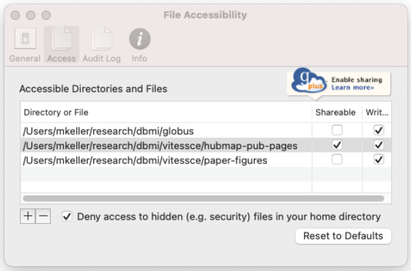  

&nbsp;&nbsp; b. Then select "Web: Transfer Files" from the _Globus_ menu.  
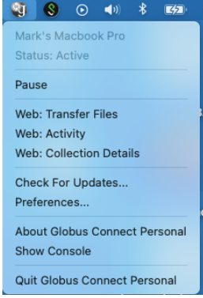  

&nbsp;&nbsp; c. Navigate to the local directory that you want to upload in the _left_ pane of Globus.  
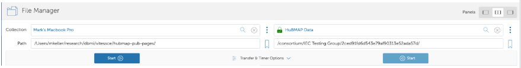  
- On the _right_ side, enter "HuBMAP Data" as the _Collection_
- Enter the path that was created for the publication

&nbsp;&nbsp; d. Select files on the left side then click the blue _Start_ button on the left side to transfer files to the right side:
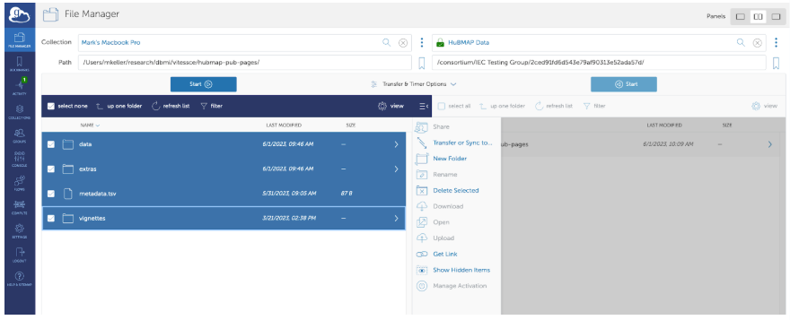  

&nbsp;&nbsp; e. Use the "Activity" tab to check the progress of the upload:
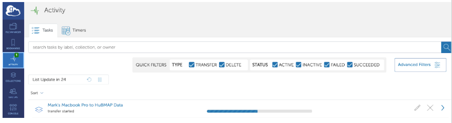  

See [Globus Connect Personal](https://www.globus.org/globus-connect-personal) for more information.  
 - This site provides installation instructions if the user isn’t already familiar with the tool.

## 4. Navigating to a Publication
After the upload is complete, navigate to the publication in the Ingest Portal.
 - In the main search, enter the Publication's HuBMAP ID or search by TYPE, then click SEARCH
    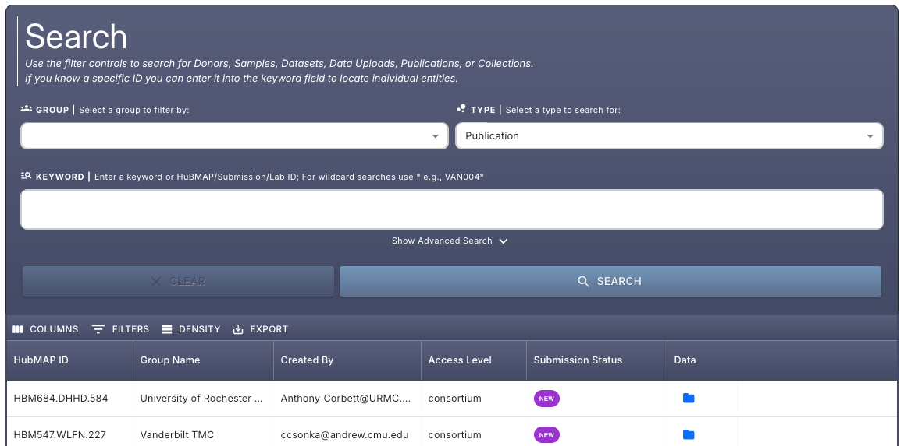  
 - This will open the "Publication Information" dialog, where you can update the descripton or other information.
  
 

<i>Click here to display &#x25BC; (or hide &#x25B6;) the image below...</i>

  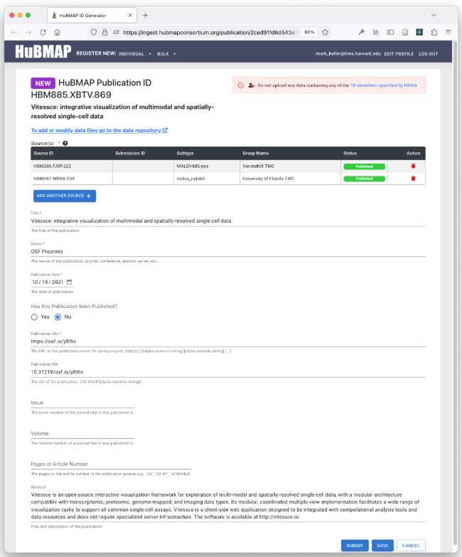  
 

### 4.1 Submitting Your Publication
&nbsp;&nbsp; a. Make any changes or updates to the publication description or other fields, if needed.

- After making any such changes, click "Save"
- In no changes are needed, proceed to the next step.

&nbsp;&nbsp; b. Click “Submit” - This will change the status of the publication to “Submitted”.
- Behind the scenes, this alerts the curation team, who will _manually_ trigger the processing of the publication dataset.

&nbsp;&nbsp; c. Once submitted, the  publication page may immediately appear [here](https://portal.hubmapconsortium.org/publications) for logged-in users. 
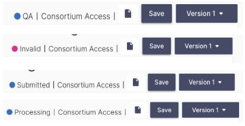  
- Some information (e.g., Vitessce visualizations, author information, etc.) will _not_ appear until   backend processes are complete...
  - The page has to reach QA status (Step 5 - see below)
  - _Processing_ status indicates the file or publication is being actively processed and not yet available.
  - _Invalid_ status indicates that there is some error with the file or publication.
    - Hover over a status value to display more information about it...
    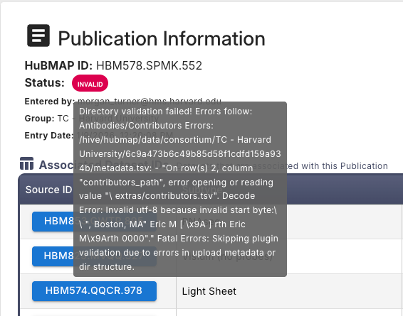  
  - _QA_ status indicates that the file or publication is undergoing quality assurance checks or validation.

## 5. Approving Your Publication
Following processing, the publication will be in “QA” state. 
- You will receive an email from [Curation](mailto://ingest@hubmapconsortium.org) with a request to review your publication.
- Publications will be publicly visible [here](https://portal.hubmapconsortium.org/publications).
- If you submitted your publication as a preprint, navigate to the “Preprint” tab to see your publication.

 

<i>Click here to display &#x25BC; (or hide &#x25B6;) the image below...</i>

  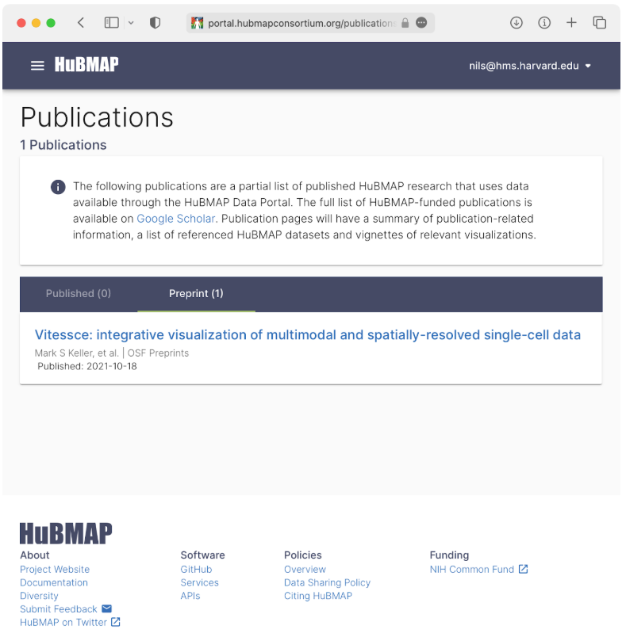  
 

## 6. Updating a Publication
### Reasons to Update:
- Preprint changes status to Published
- Finalized citation info becomes available (volume, issue, pages)
- Corrections to metadata (title change, author updates)
- Add or update links, supporting resources, and/or visualizations in vignettes

### Metadata Updates:
 - Publication entities can be modified _prior_ to submission.
   - Updates to metadata such as the publication title or abstract can be performed in the [Ingest Portal](https://ingest.hubmapconsortium.org/).
 - After submission, if further changes are needed, submit a [Help Desk Ticket](mailto://help@hubmapconsortium.org)
   - Be sure to include the fields and changes required.

### Data and Vignette Updates:
- Updates to data files or vignettes should be made in the data directory.
- A link to the data directory is provided on the "Publication Information" page in the HuBMAP Ingest Portal.
- After completing updates to the data directory contents, submit a [Help Desk Ticket](mailto://help@hubmapconsortium.org)
- Once a publication page’s status is Published, a new publication version must be created.
- Create a new Publication submission and reference the previous publication’s HuBMAP ID or UUID.

 

<i>Click here to display &#x25BC; (or hide &#x25B6;) the <em>Update Workflow diagram</em> below...</i>

  <h3>Workflow Diagram for Updates</h3>
  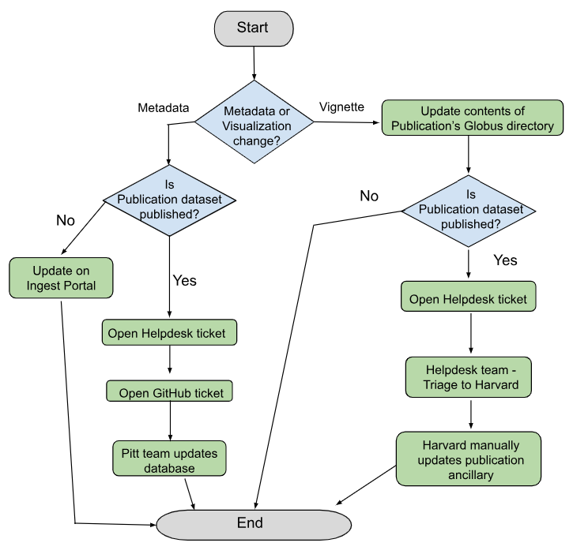  
 

