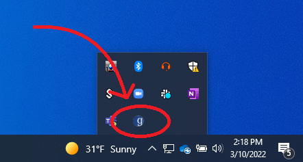
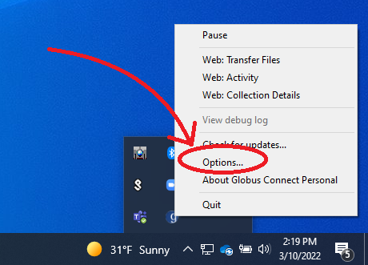
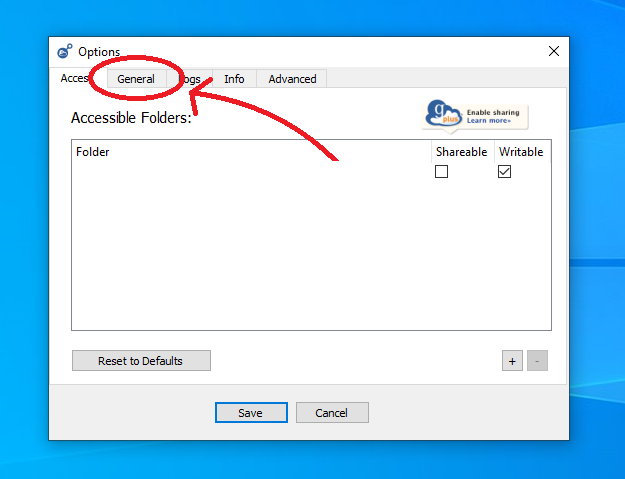
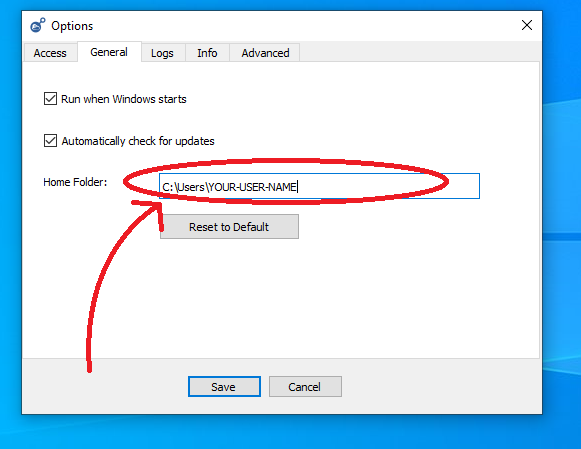

### Installing and Getting Started with the HuBMAP Command Line Transfer

The HuBMAP Command Line Transfer utility provides the functionality to download HuBMAP data of individual files and directories across multiple datasets/uploads at one time by specifying all downloaded data files and directories in a single manifest file.

This document covers installation of the HuBMAP CLT along with the Globus Connect Personal endpoint which is required to download data from HuBMAP.


#### Globus Prerequisites 

In order to download any content from Globus, users must install **_Globus Connect Personal_** on their device. This 
creates a globus "Endpoint" locally. Downloads take the form of transfers from the desired Collection to the endpoint 
created on the local machine. Instructions on installing **_Globus Connect Personal_** can be found <a href="https://www.globus.org/globus-connect-personal">Here</a>

During setup, users will have the opportunity to name their Endpoint and log in with their Globus Credentials

#### **_IMPORTANT NOTE ABOUT GLOBUS CONNECT PERSONAL_**

While GCP on linux chooses your home directory as the download location by default, if you are using windows, it is likely that the default download location will not be your home directory. Its location can be somewhat inconsistent especially if you use OneDrive. Regardless of your operating system, it is recommended that you confirm where GCP has selected as the default download directory or you may experience some difficulty
finding your downloaded files. To view the download directory on windows 10/11, find the GCP icon in the system tray. If the "g" logo is neither on the right side of the task bar, nor in the hidden icons menu, GCP may not be running; in this case you must launch GCP first.



Right-click on the GCP icon to see the context menu. This menu will contain an options button



Inside the options menu, navigate to the General Tab



Here we can see precisely where the globus downloads are mounted. If a specific destination path is used during your download, the path will be relative to this point. 



#### Installing the HuBMAP CLT

The HuBMAP CLT is available as a part of a Python package called `atlas-consortia-clt`.
  - Python 3 is required to run the HuBMAP CLT, an installer for it can be downloaded [here](https://www.python.org/downloads/).
  - It is recommended that you create a new Python virtual environment first with `python3 -m venv /path/to/new/virtual/environment`, more information on Python virtual environments is available [here](https://docs.python.org/3/library/venv.html).
  - To install the HuBMAP CLT run the pip command shown below after installing Python and creating and activating a new Python virtual environment.

Note: The HuBMAP CLT requires Python 3.9 or above.

Note: Installation will also install other requirements needed by the the HuBMAP CLT, including the Globus [Command Line Tool](https://docs.globus.org/cli/). The Globus command line tool is a separate tool from **_Globus Connect Personal_**.

The HuBMAP CLT can be installed using multiple methods:

##### pip

Install the HuBMAP CLT globally using pip:
```bash
pip install atlas-consortia-clt
```

##### pip with a virtual environment

Installing in a virtual environment keeps the HuBMAP CLT and its dependencies isolated from other Python projects.

**macOS/Linux:**
```bash
python3 -m venv clt-env # creates virtual environment named clt-env in the current directory
source clt-env/bin/activate # activates the virtual environment
pip install atlas-consortia-clt
```

**Windows:**
```bash
python -m venv clt-env # creates virtual environment named clt-env in the current directory
clt-env\Scripts\activate # activates the virtual environment
pip install atlas-consortia-clt
```

To use the HuBMAP CLT in the future, activate the virtual environment first:

**macOS/Linux:**
```bash
source clt-env/bin/activate
```

**Windows:**
```bash
clt-env\Scripts\activate
```

To deactivate the virtual environment, run the following command on any platform:
```bash
deactivate
```

##### pipx

[pipx](https://pipx.pypa.io) installs the HuBMAP CLT in its own isolated environment and automatically exposes the `hubmap-clt` commands on your `PATH`, without affecting other Python packages.

Install pipx if you don't have it. Check the [pipx documentation](https://pipx.pypa.io/stable/#install-pipx) for detailed installation instructions.

Then install the HuBMAP CLT. The HuBMAP CLT relies on the `globus-cli` package and must also be installed via pipx.
```bash
pipx install atlas-consortia-clt globus-cli
```

To upgrade:
```bash
pipx upgrade atlas-consortia-clt globus-cli
```

#### Log in to the HuBMAP CLT

A one-time login is required for any download session. For non-public data, you must log in with your HuBMAP account. For publicly available data, you can log in with any account accepted by the login form (Google and ORCID). Login can be initiated using the following command:

```bash
hubmap-clt login
```

By default, login will automatically open a browser window to complete authentication. If you are in a headless environment (e.g. a remote server without a browser), use the `--no-browser` flag. This will display a URL in the terminal that you can copy and open in a browser on another device to complete the login:

```bash
hubmap-clt login --no-browser
```

You can check if you are currently logged in with the following command:

```bash
hubmap-clt whoami
```

#### Using the HuBMAP CLT

At this point, you should be set up and ready to use the HuBMAP Command Line Transfer tool. Detailed instructions of its usage can be found [here](index.html).
