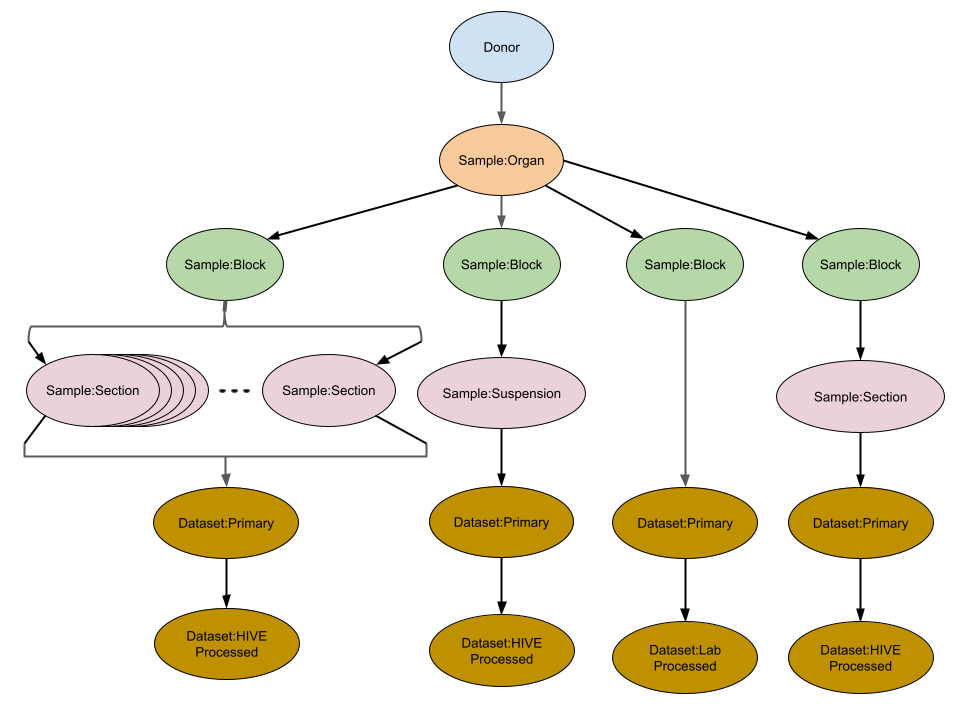

# HuBMAP Provenance Graph

## Overview:
HuBMAP metadata which describes tissue donors, organs, tissue samples and datasets is stored in a hierarchical graph to track the provenance of any data registered in HuBMAP back through any other data, tissue samples, organs and donors from which each is derived.

## Description:
The provenance graph, an example of which for the data derived from a single tissue donor is shown below, contains three main types of graph node or entity types: Donors, Samples and Datasets. Each of these main entity types contain sub-types:
  - Donor
    - Organ Donor (findable by the existence of the field `Donor.metadata.organ_donor_data`)
    - Living/Surgical Donor (findable by the existance of the field `Donor.metadata.living_donor_data`)
  - Sample
    - Organ (findable by matching `Sample.sample_category == "organ"`)
    - Tissue Block (findable by matching `Sample.sample_category == "block"`)
    - Tissue Section (findable by matching `Sample.sample_category == "section"`)
    - Tissue Suspension (findable by matching `Sample.sample_category == "suspension"`)
  - Dataset
    - Primary Data: data registered and uploaded by HuBMAP data providers, this data must have a direct parent entity in the provenance graph of type Sample.  (findable by matching `Dataset.creation_action == "Create Dataset Activity"`)
    - HuBMAP Processed Data: Data created by one of the central [HuBMAP HIVE processing pipelines](https://docs.hubmapconsortium.org/pipelines.html). This data must have a direct parent entity in the provenance graph of type Dataset, i.e., data derived by processing other data. (findable by matching `Dataset.creation_action == "Central Process"`)
    - Lab/Provider Processed Data: Data created by one of the HuBMAP data provider labs by processing primary data. This data must have a direct parent entity in the provenance graph of type Dataset. (findabe by matching `Dataset.creation_action == "Lab Processed"`)

    

